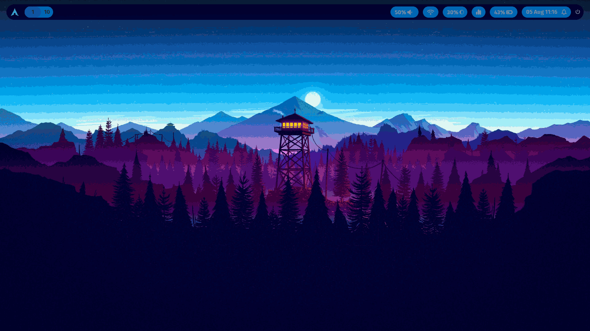

# ❄️ Hyprland Config – pywal

Minimal Hyprland config with colors based on wallpaper

---

## 📷 Presentation


*Main desktop*

[//]: # (| |  |)
[//]: # (|:---:|:---:|)
[//]: # (| *Wykaz okien / Rofi* | *Lockscreen / Menu wyłączania* |)

---

## 🛠️ Installation

This config is managed with **GNU Stow**

### 1. Dependencies
Ensure you have the following installed on your system (Arch Linux example):

```bash
sudo pacman -S --needed git stow hyprland xdg-desktop-portal-hyprland xdg-desktop-portal xdg-desktop-portal-gtk rofi alacritty hyprpaper polkit-kde-agent wlogout hyprlock hypridle grim slurp swappy lf ttf-fira-sans otf-font-awesome spicetify-cli waybar cava nemo nemo-fileroller pywal-16-colors swaync power-profiles-daemon
```

### 2. Apply configuration
First, check out the dotfiles repo in your $HOME directory using git

```bash
git clone git@github.com:V0Iek/hyprland.git .dotfiles/hyprland
cd .dotfiles
```

then use GNU stow to create symlinks

```
stow hyprland
```
